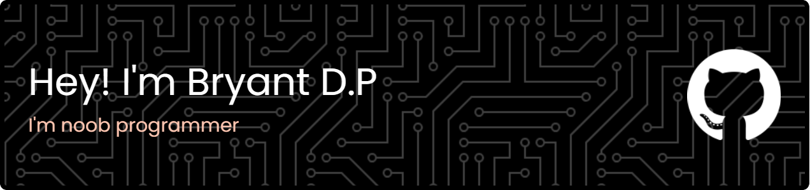

## Hi there 👋

**briyantdp/briyantdp** is a ✨ _special_ ✨ repository because its `README.md` (this file) appears on your GitHub profile.

Here are some ideas to get you started:

- 🔭 I’m currently working on ...
- 🌱 I’m currently learning ...
- 👯 I’m looking to collaborate on ...
- 🤔 I’m looking for help with ...
- 💬 Ask me about ...
- 📫 How to reach me: ...
- 😄 Pronouns: ...
- ⚡ Fun fact: ...

 

## :hammer_and_wrench: Languages and Tools :

  
  ### :hammer_and_wrench: Programming Language :
  &nbsp;
  &nbsp;
  &nbsp;
  &nbsp;
  &nbsp;

   ### :hammer_and_wrench: Front End :
   
  &nbsp;
  &nbsp;
  &nbsp;
  &nbsp;
  &nbsp;
  &nbsp;
  &nbsp;

   ### :hammer_and_wrench: Mobile Dev :
  &nbsp;
  &nbsp;

   ### :hammer_and_wrench: Back End :
  &nbsp;
  &nbsp;
  &nbsp;
  &nbsp;
  &nbsp;
  &nbsp;

   ### :hammer_and_wrench: Etc :
  
  
  
  
  

<h3 align="left">Connect with me:</h3>

  
  

